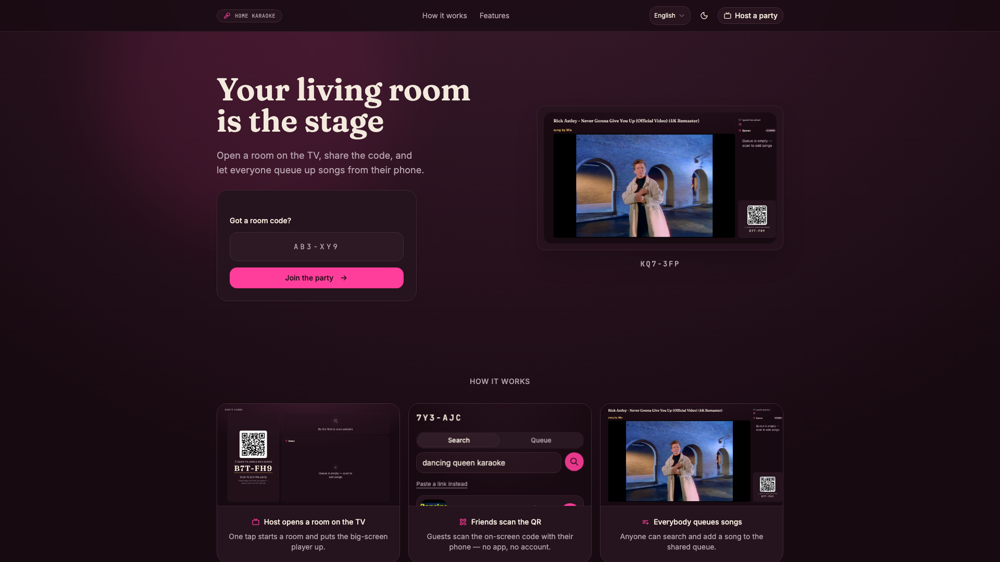
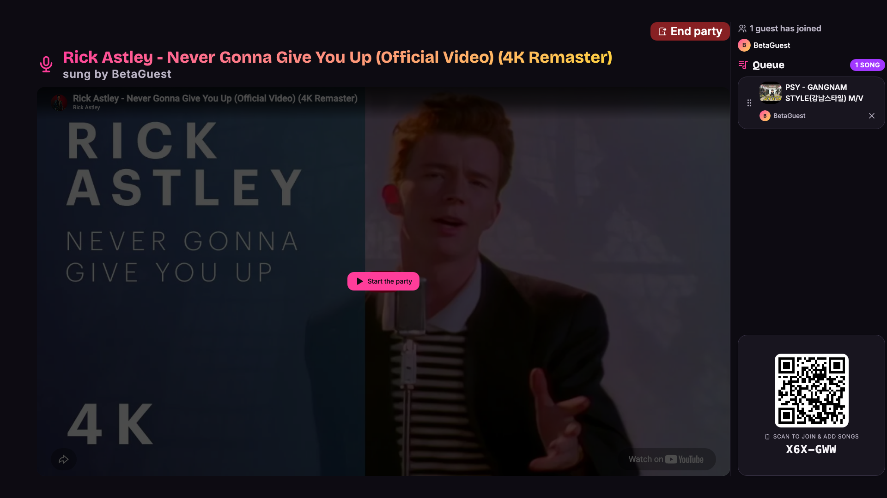
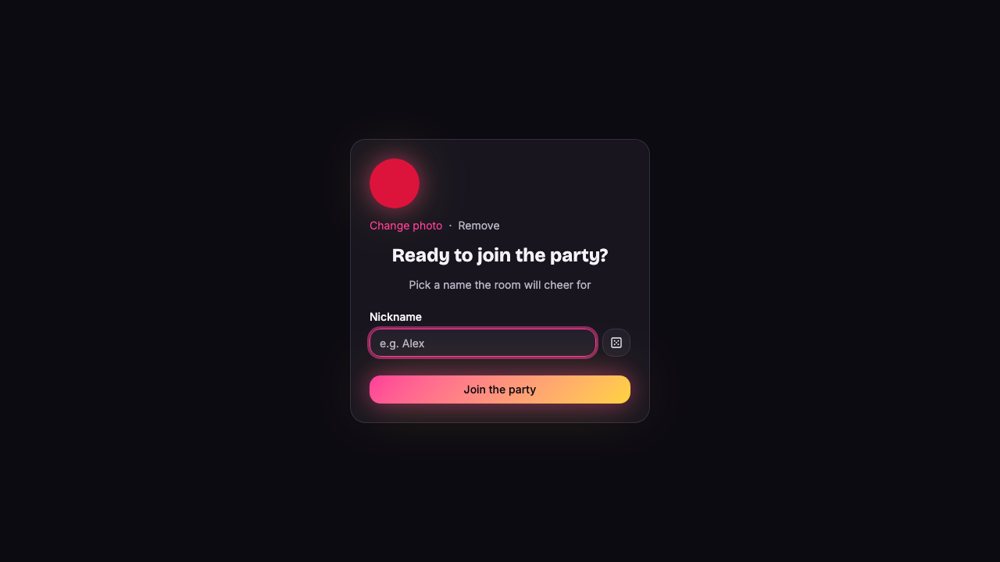
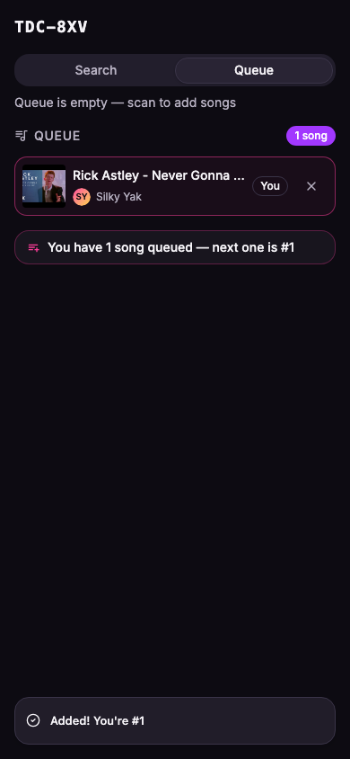
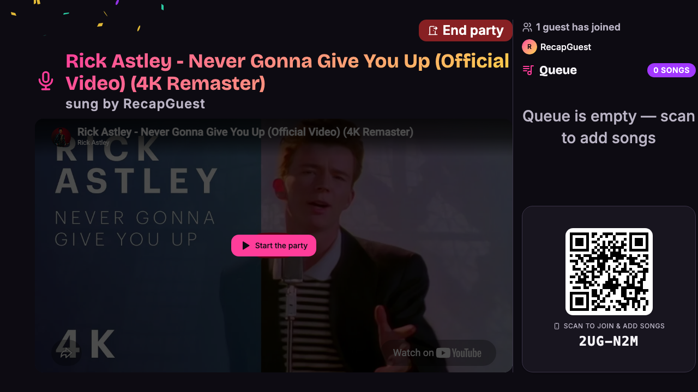
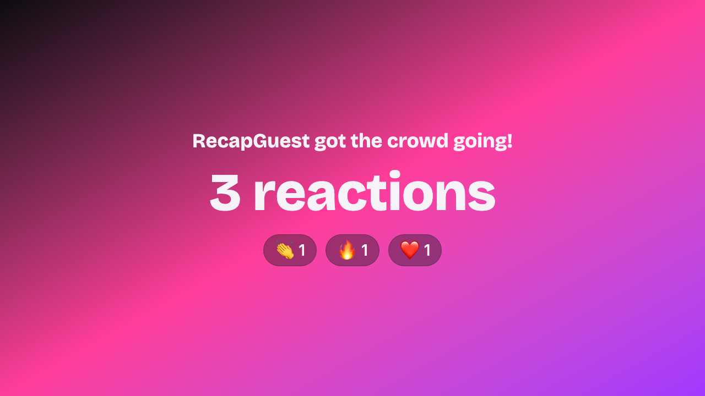
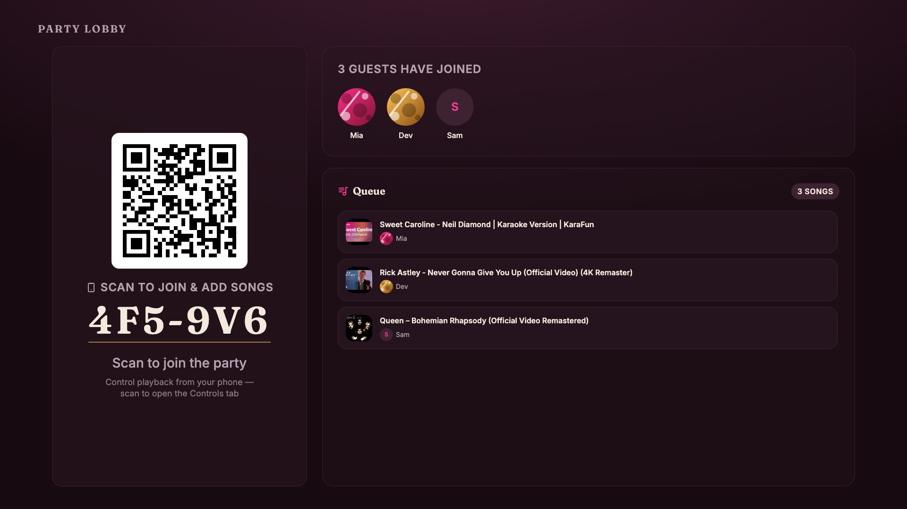

# 🎤 home-karaoke

**Turn your TV into a karaoke machine and everyone's phone into the remote.**

[](https://workers.cloudflare.com/)
[](https://reactrouter.com/)
[](https://effect.website/)
[](https://www.typescriptlang.org/)


One person opens a room on the big screen. Everyone else scans the QR code, picks a nickname, and starts adding songs from their phone. The queue, the video, and the crowd all stay in sync — no app to install, no accounts to create, no cables to pass around. It's group karaoke for your living room, built on YouTube.

---

## See it in action

**Land on the page and start a party.** Type a room code to join one, or hit "Host a party" to open your own on the TV.



**The host screen is the stage.** A full-screen YouTube player fills the TV, with a side rail showing who's in the room, what's queued next, and the QR code + room code for anyone still joining.



**Guests join in seconds.** Scan the QR, pick a name the room will cheer for, and add a profile photo if you want one. No signup, no password — just a nickname.



**Everyone queues from their phone.** Search YouTube (results are biased toward karaoke versions) or paste a link, tap to add, and you'll see exactly where you land: "Added! You're #1."



**The crowd reacts in real time.** Guests tap emojis on their phones and they fly up the TV screen, Google-Meet-style, while the current singer performs.



**Every song gets an ending.** When a song wraps, the TV shows a quick recap card tallying the reactions the singer just earned — a little applause before the next person is up.



**Faces, not just names.** Guest avatars show up across the TV — in the roster, the queue, and the "you're up" overlay — with a colorful initials avatar when someone skips the photo.



---

## Why it's built this way

- **No app install, no accounts for guests.** Karaoke night shouldn't start with an app-store download. Guests scan a QR and pick a nickname — that's it. Under the hood that's an anonymous [Better Auth](https://better-auth.com/) session, so there's a real identity behind each guest without anyone signing up.
- **Everything syncs live.** Add a song on your phone and it appears on the TV instantly; the host hits skip and every phone updates. Each room runs on a single WebSocket connection to a raw Cloudflare **Durable Object** (`KaraokeRoom`, backed by SQLite storage with WebSocket Hibernation), which owns the live queue, playback state, and roster. State transitions are pure functions in [`app/lib/room-state.ts`](app/lib/room-state.ts), so the behavior is testable without a browser.
- **It runs entirely on Cloudflare's edge.** No servers to babysit. The app is a Cloudflare Worker (React Router v7 for SSR), durable room records + played-song history live in **D1** (SQLite via Drizzle), guest photos live in **R2**, and search comes from the **YouTube Data API v3** with a keyless paste-a-link fallback so it works even without an API key.
- **Rooms clean up after themselves.** A room auto-closes after 1 hour idle via a Durable Object alarm — no lingering sessions.

Full feature write-up: [`.brain/features/group-karaoke/group-karaoke.md`](.brain/features/group-karaoke/group-karaoke.md).

---

## Quick Start

### Prerequisites

```bash
# Bun (package manager + runtime)
curl -fsSL https://bun.sh/install | bash

# Cloudflare CLI
bun add -g wrangler
wrangler login
```

### Option A — Automated setup (recommended)

```bash
bun run scripts/first-time-setup.ts
```

The wizard creates your D1 database, R2 bucket, optional KV namespace, generates a `BETTER_AUTH_SECRET`, writes `wrangler.jsonc` + `.env`, runs migrations, and deploys. ~3 min end-to-end.

### Option B — Manual

```bash
bun install                 # also runs cf-typegen + git hooks install
bun run db:migrate:local    # apply migrations to local D1
bun run db:seed             # seed local D1 with admin/user/banned fixtures
bun run dev                 # http://localhost:5173
```

---

# Developer & agent guide

Everything below is for people (and agents) working *on* home-karaoke. The app is built on a **harness-first, AI-first** Cloudflare stack — retrieval-based docs, paste-able recipes, and deterministic verification gates so any coding agent (Claude Code, Cursor, Codex) can ship real features without drifting.

If you're a human contributor, read [`CLAUDE.md`](CLAUDE.md) once — it points to everything else. If you're an agent, start at [How to work in this repo](#how-to-work-in-this-repo).

## What's in the box

**Stack**
- **Runtime:** Cloudflare Workers (no Node), React Router v7 SSR
- **Server logic:** tRPC v11 procedures wrapped in Effect TS
- **Persistence:** D1 (SQLite) via Drizzle ORM 0.45, R2 for files
- **Live state:** raw Durable Object (`KaraokeRoom`) — SQLite storage + WebSocket Hibernation
- **Auth:** Better Auth 1.4 with Drizzle adapter + admin plugin (RBAC) + anonymous plugin (guests)
- **External:** YouTube Data API v3 (karaoke-biased search) + keyless oEmbed paste-a-link fallback
- **Validation:** Effect Schema everywhere — no Zod
- **Errors:** `Data.TaggedError` mapped to tRPC codes via `tagToTRPC`
- **UI:** ShadCN/Radix + Tailwind v4 (oklch), next-themes, react-hook-form + Effect resolver
- **i18n:** remix-i18next + i18next, route-level namespaces, fully typed
- **Testing:** Vitest 3 (unit) + Playwright 1.58 (e2e) + `@effect/vitest`
- **Background:** Cloudflare Workflows (`ExampleWorkflow`)

**Agent harness**
- `.brain/` — retrieval-first docs (rules, architecture, features, recipes, runs)
- `.brain/recipes/` — paste-able runbooks bookended by `00-before-task.md` (init) and `99-verify-done.md` (termination check)
- `.brain/runs/` — per-task continuity log so multi-session work survives compaction
- `.githooks/pre-commit` — typecheck + tests block broken commits (no-dep, auto-installs)
- `.claude/hooks/brain-reminder.sh` — staged-path → relevant-doc reminder before commit
- `.claude/commands/verify-done.md` — `/verify-done` slash command runs the full termination checklist
- `CLAUDE.md` / `AGENTS.md` — kept byte-identical, both are the agent entry point

## How to work in this repo

### For humans

Read [`CLAUDE.md`](CLAUDE.md) once. It points to everything else.

### For agents

You're working in a codebase with strict conventions. Skipping the brain will cost rework. Every non-trivial task has three phases — each gated by a slash command.

**1. Init — [`/start-task`](.claude/commands/start-task.md)** (or [`.brain/recipes/00-before-task.md`](.brain/recipes/00-before-task.md))
- Runs `./init.sh --baseline` to capture pre-change typecheck + test state
- Reads the brain (matching `.brain/<folder>/index.md` + triggered files)
- Frames task: intent, domain, scope, affected feature(s)
- Validates scope policy via `jq` on [`feature_list.json`](.brain/features/feature_list.json) — refuses if >1 feature in progress
- Opens run note (`.brain/runs/<date>-<slug>.md`) for >30min work
- Appends entry to [`.brain/runs/progress.md`](.brain/runs/progress.md)

**2. Work — pick the runbook**
- Adding code → matching recipe in [`.brain/recipes/index.md`](.brain/recipes/index.md)
- Refactor / bugfix → the layer's rule file in [`.brain/rules/index.md`](.brain/rules/index.md)
- Feature work → existing memo in [`.brain/features/<slug>.md`](.brain/features/index.md), plus past attempts in [`.brain/runs/`](.brain/runs/)

**3. Verify — [`/verify-done`](.claude/commands/verify-done.md)** (or [`.brain/recipes/99-verify-done.md`](.brain/recipes/99-verify-done.md))
- typecheck + test + e2e (if cross-component) + build (if CF-touching) + manual UI smoke (if UI)
- Brain coherence: every diffed path → owning brain doc updated
- Five non-negotiables grep-clean
- Close the run note if you opened one

**Shipping a feature — [`/ship-feature`](.claude/commands/ship-feature.md)**
- Runs `/verify-done`, flips `feature_list.json` status to `"shipped"`, updates per-feature MD changelog, closes run note, runs `/harness-check`. Refuses on red.

**The five non-negotiables** (also in [`.brain/codebase/effect-ts.md`](.brain/codebase/effect-ts.md)):

1. **Effect TS by default.** No `throw`. No `try/catch` outside `Effect.tryPromise`.
2. **Effect Schema for validation.** No Zod.
3. **Tagged errors only.** All in `app/models/errors/`. Map every one in `app/lib/effect-trpc.ts`.
4. **Unit test every helper, repository, and service.** See [`.brain/codebase/testing.md`](.brain/codebase/testing.md).
5. **Cloudflare Workers, not Node.** Bindings via the `CloudflareEnv` Tag. Never `process.env`.

## Harness — the system around the agent

This repo follows the [walkinglabs 5-subsystem harness framework](https://github.com/walkinglabs/learn-harness-engineering/tree/main/skills/harness-creator). The harness is everything that keeps coding agents reliable across sessions: instructions, state, verification, scope, and lifecycle.

Single explainer: [`.brain/HARNESS.md`](.brain/HARNESS.md). The 5 subsystems mapped to actual files:

| Subsystem | Artifacts |
|-----------|-----------|
| **Instructions** | [`CLAUDE.md`](CLAUDE.md) / [`AGENTS.md`](AGENTS.md), [`.brain/`](.brain/) (rules, recipes, features) |
| **State** | [`.brain/features/feature_list.json`](.brain/features/feature_list.json) (machine-readable status), [`.brain/runs/progress.md`](.brain/runs/progress.md) (rolling cursor), per-task `.brain/runs/<date>-<slug>.md` |
| **Verification** | [`.brain/recipes/99-verify-done.md`](.brain/recipes/99-verify-done.md), [`/verify-done`](.claude/commands/verify-done.md), [`scripts/harness-check.sh`](scripts/harness-check.sh) |
| **Scope** | One in-progress feature at a time (enforced by [`feature_list.json`](.brain/features/feature_list.json) + [`harness-check.sh`](scripts/harness-check.sh)); ≤2 features per diff |
| **Lifecycle** | [`init.sh`](init.sh), [`.claude/hooks/session-start.sh`](.claude/hooks/session-start.sh) (SessionStart hook), [`.claude/hooks/brain-reminder.sh`](.claude/hooks/brain-reminder.sh) (PreToolUse hook) |

### Slash commands (deterministic gates)

| Command | What it does |
|---------|--------------|
| [`/start-task`](.claude/commands/start-task.md) | Kickoff: `init.sh --baseline` + brain read + framing + run note + progress entry. Refuses if scope policy violated. |
| [`/verify-done`](.claude/commands/verify-done.md) | Full verification: typecheck/test/e2e/build/UI/brain coherence/non-negotiables. |
| [`/ship-feature`](.claude/commands/ship-feature.md) | Close out: `/verify-done` + flip `feature_list.json` + update feature MD + close run note + `/harness-check`. |
| [`/harness-check`](.claude/commands/harness-check.md) | 11 deterministic invariants via [`scripts/harness-check.sh`](scripts/harness-check.sh) (no LLM, exits non-zero on drift). |

The two scripts (`init.sh` + `scripts/harness-check.sh`) are pure shell — run them yourself anytime to verify state without invoking Claude.

### Project-local sub-agents ([`.claude/agents/`](.claude/agents/))

Five subagents wrap specific harness pieces. The main thread delegates to these so it doesn't have to re-load harness rules every turn.

| Agent | Use when |
|-------|----------|
| [`brain-navigator`](.claude/agents/brain-navigator.md) | Before writing code — get the reading list for a task |
| [`recipe-runner`](.claude/agents/recipe-runner.md) | Adding code that matches one of the 8 `add-*` recipes |
| [`effect-ts-enforcer`](.claude/agents/effect-ts-enforcer.md) | After writing — review diff against the 5 non-negotiables |
| [`verify-done-runner`](.claude/agents/verify-done-runner.md) | Before declaring done — runs the full verification checklist |
| [`feature-tracker`](.claude/agents/feature-tracker.md) | Status changes (start / ship / block / scope a feature) |

See [`.claude/agents/README.md`](.claude/agents/README.md) for invocation flow + complementary plugin agents.

## The `.brain/` directory

Retrieval-over-recall. Each subdirectory has an `index.md` that signals "read me when X". Don't open files at random — start at the index.

```
.brain/
├── HARNESS.md                 The harness, explained — single overview of the 5 subsystems
├── high-level-architecture/   System layers, data flow, security, integrations
├── codebase/                  Effect TS programming model, helpers, tests, i18n, tRPC API
├── rules/                     7 layer-aligned rules (frontend / cloudflare / repository /
│                               services / routes / library / errors)
├── recipes/                   Paste-able runbooks (00-before-task / 99-verify-done bookends + add-*)
├── runs/                      progress.md (rolling cursor) + per-task <date>-<slug>.md work logs
├── features/                  Per-feature memory + feature_list.json (machine-readable status)
├── transcripts/               Meeting notes / decision logs (the "why")
├── emails/                    Stakeholder correspondence
└── CHANGELOG.md               Architectural + brain shifts (not a code changelog)
```

### When to read what

| Task | Open |
|------|------|
| Adding any code | [`recipes/index.md`](.brain/recipes/index.md) → pick a recipe |
| Editing UI / forms / Tailwind | [`rules/frontend.md`](.brain/rules/frontend.md) |
| Editing a repository | [`rules/repository.md`](.brain/rules/repository.md) |
| Editing a service | [`rules/services.md`](.brain/rules/services.md) |
| Editing a tRPC route or page loader | [`rules/routes.md`](.brain/rules/routes.md) |
| Editing wrangler / bindings / Workflows | [`rules/cloudflare.md`](.brain/rules/cloudflare.md) |
| Adding a tagged error | [`rules/errors.md`](.brain/rules/errors.md) + [`recipes/add-tagged-error.md`](.brain/recipes/add-tagged-error.md) |
| Helpers / Effect Schema / tests | [`rules/library.md`](.brain/rules/library.md) |
| Designing a feature | [`features/index.md`](.brain/features/index.md) → `_TEMPLATE.md` → existing examples |
| Tracing a constraint with no obvious "why" | [`transcripts/`](.brain/transcripts/) and [`emails/`](.brain/emails/) |

## Recipes — paste-able runbooks

Each recipe is a deterministic checklist with code snippets, brain-doc updates, and a "definition of done". Designed for one-shot agent execution.

| Recipe | When |
|--------|------|
| [`00-before-task.md`](.brain/recipes/00-before-task.md) | **Bookend.** Run at the start of every non-trivial task |
| [`99-verify-done.md`](.brain/recipes/99-verify-done.md) | **Bookend.** Run before declaring a task done. Also `/verify-done` |
| [`add-trpc-endpoint.md`](.brain/recipes/add-trpc-endpoint.md) | New tRPC procedure (query/mutation) |
| [`add-db-table.md`](.brain/recipes/add-db-table.md) | New D1 table + Drizzle schema + repository |
| [`add-tagged-error.md`](.brain/recipes/add-tagged-error.md) | New domain error + `tagToTRPC` mapping |
| [`add-cf-binding.md`](.brain/recipes/add-cf-binding.md) | New Cloudflare binding (KV, DO, Queue, Vectorize, etc.) |
| [`add-service.md`](.brain/recipes/add-service.md) | New Effect service (external client, lifecycle-bearing) |
| [`add-route.md`](.brain/recipes/add-route.md) | New React Router page (loader / action / UI / i18n) |
| [`add-feature.md`](.brain/recipes/add-feature.md) | End-to-end feature combining the above |

[`recipes/index.md`](.brain/recipes/index.md) also has decision trees (e.g. "tRPC vs Workflow vs Queue?", "D1 vs R2 vs KV?") to disambiguate before you start.

## Guardrails

These run automatically — you do not need to remember them.

### Pre-commit gate ([`.githooks/pre-commit`](.githooks/pre-commit))

Triggered on `git commit`. Skips entirely if no `.ts/.tsx/.js/.jsx` files are staged. Otherwise:

```bash
bun run typecheck     # cf-typegen + react-router typegen + tsc -b
bun run test          # vitest run (123+ unit tests)
```

Auto-installed via `postinstall` (sets `core.hooksPath = .githooks`). Re-install manually with `bun run hooks:install`. Bypass for an emergency commit:

```bash
SKIP_HOOKS=1 git commit -m "..."
```

### Brain reminder ([`.claude/hooks/brain-reminder.sh`](.claude/hooks/brain-reminder.sh))

Fires from Claude Code's `PreToolUse` hook on `git commit*`. Looks at staged paths and prints which `.brain/` docs likely need updating. Cheap shell script — no LLM call, never blocks.

Example output:

```
🧠 Brain-update reminder (commit not blocked):
  • app/db/schema.ts → .brain/high-level-architecture/data-models.md + .brain/codebase/api.md
  • app/repositories/ → .brain/rules/repository.md
```

### CLAUDE.md ↔ AGENTS.md sync

Both files are byte-identical by design — `CLAUDE.md` for Claude Code, `AGENTS.md` for AGENTS-spec tools (Codex, Aider). When you edit one, mirror to the other:

```bash
cp CLAUDE.md AGENTS.md
```

(There's no CI check yet — that's tracked.)

## Project layout

```
app/
├── auth/             Better Auth server config + client
├── components/       UI — shadcn primitives in ui/, feature components alongside
├── db/               Drizzle schema + connection
├── hooks/            React hooks
├── i18n/             SSR + client i18next setup, types
├── lib/              Helpers — schemas/, logger, effect-trpc, effect-utils
├── locales/en/       Translation JSON files (one per namespace)
├── models/errors/    Tagged error classes
├── repositories/     Drizzle-backed Effect.Service repositories
├── routes/           React Router v7 file-based routes
├── services/         Effect Tag/Layer services (Database, Bucket, AuthApi, etc.)
├── trpc/             tRPC router + procedures + middleware
├── routes.ts         Route config
├── runtime.ts        ManagedRuntime composition (services + repos)
├── root.tsx          Root layout
└── entry.{client,server}.tsx
.brain/               Agent-readable docs (see above) — includes HARNESS.md
.githooks/            Git hooks (pre-commit gate)
.claude/              Claude Code config — settings, hooks, agents/, commands/
drizzle/              SQL migrations
e2e/                  Playwright tests
public/               Static assets
scripts/              Setup / teardown / seed + harness-check.sh
workers/app.ts        Cloudflare Workers entrypoint
workflows/            Cloudflare Workflow definitions
init.sh               Harness bootstrap — install + migrate + typecheck + test
```

## Commands

```bash
./init.sh                     # Harness bootstrap — install + migrate + typecheck + test
./init.sh --baseline          # Baseline only (typecheck + test) — used by /start-task
./init.sh --quick             # Skip install + migrate (assume already done)
./scripts/harness-check.sh    # 11 deterministic harness invariants (also: /harness-check)

bun run dev                   # Dev server (auto-runs local DB migrations) → :5173
bun run build                 # Production build
bun run deploy                # Build + deploy to Cloudflare Workers
bun run preview               # Build + serve locally via the Cloudflare Vite plugin (vite preview)

bun run typecheck             # cf-typegen + react-router typegen + tsc -b
bun run test                  # Vitest (one-shot)
bun run test:watch            # Vitest watch
bun run test:e2e              # Playwright
bun run test:e2e:ui           # Playwright UI mode
bun run test:e2e:report       # Open last Playwright report

bun run db:generate           # Generate Drizzle migration from schema
bun run db:migrate:local      # Apply migrations to local D1
bun run db:migrate:remote     # Apply migrations to remote D1
bun run db:seed               # Seed local D1 with admin/user/banned fixtures
bun run db:seed:preview       # Seed the preview-env D1 with the same fixtures
bun run db:studio             # Drizzle Studio (visual DB editor)

bun run cf-typegen            # Regenerate worker-configuration.d.ts
bun run hooks:install         # Re-install pre-commit gate
bun run setup                 # First-time wizard
bun run teardown              # Tear down Cloudflare resources
```

## Authentication

[Better Auth](https://better-auth.com/) 1.4 with the Drizzle adapter and `admin()` plugin for RBAC.

- Auth handler: `/api/auth/*` ([`app/routes/api/auth.$.ts`](app/routes/api/auth.$.ts))
- Server config: [`app/auth/server.ts`](app/auth/server.ts)
- Client: [`app/auth/client.ts`](app/auth/client.ts) (uses `adminClient()` plugin)
- Session reading in loaders: `context.auth.api.getSession({ headers: request.headers })`
- Session reading in Effects: yield the `Session` Tag from [`app/services/session.ts`](app/services/session.ts)

**RBAC — admin role enforcement is two-layered:**

- **Page-level** — admin route loaders redirect non-admins (see [`app/routes/admin/_layout.tsx`](app/routes/admin/_layout.tsx))
- **Procedure-level** — `adminProcedure` middleware in [`app/trpc/index.ts`](app/trpc/index.ts) rejects non-admins server-side

Never trust the page guard alone — UI hiding doesn't equal authorization.

**Set the production secret:**

```bash
openssl rand -base64 32
wrangler secret put BETTER_AUTH_SECRET
```

**Promote a user to admin** — Drizzle Studio:

```bash
bun run db:studio
# Open user table → edit `role` cell → change "user" → "admin" → save
```

Or remote:

```bash
bunx wrangler d1 execute YOUR_DB_NAME --remote \
  --command "UPDATE user SET role = 'admin' WHERE email = 'user@example.com'"
```

Or seed the fixture accounts locally:

```bash
bun run db:seed
```

Gives you `admin@preview.local` / `Password123!` (plus `user@preview.local`
and `banned@preview.local`). See [Database](#database) below and
[`.brain/rules/repository.md`](.brain/rules/repository.md) ("Seed data").

## Database

D1 (SQLite) accessed through Drizzle. Schema lives in [`app/db/schema.ts`](app/db/schema.ts) — single file at current scale.

**Workflow for schema changes:**

```bash
# 1. Edit app/db/schema.ts
# 2. Generate migration
bun run db:generate
# 3. Review SQL in drizzle/<NNNN>_<name>.sql
# 4. Apply locally
bun run db:migrate:local
# 5. After PR merge, apply to prod
bun run db:migrate:remote
```

> Use SQL defaults for timestamps (`unixepoch('subsecond') * 1000`), not JS-side `new Date()`. See [`recipes/add-db-table.md`](.brain/recipes/add-db-table.md).

## UI / Design system

ShadCN primitives in [`app/components/ui/`](app/components/ui/). Compose into feature components elsewhere. Tailwind v4 with oklch CSS variables in [`app/app.css`](app/app.css).

Add a shadcn component:

```bash
bunx shadcn@latest add <component-name>
```

**Forms — always Effect Schema + `effectResolver`** (no Zod resolver):

```ts
import { effectResolver } from "@hookform/resolvers/effect-ts";
import { LoginSchema, type LoginInput } from "@/lib/schemas/auth";

const form = useForm<LoginInput>({
  resolver: effectResolver(LoginSchema),
});
```

**Dark mode** is wired via `next-themes` (`attribute="class"`, `defaultTheme="system"`).

**i18n** — every route declares its namespaces and uses the matching `useTranslation()`:

```ts
export const handle = { i18n: ["dashboard", "common"] };
// Inside the component:
const { t } = useTranslation("dashboard");
```

Strings live in [`app/locales/en/<namespace>.json`](app/locales/en/). Types in [`app/i18n/i18n.d.ts`](app/i18n/i18n.d.ts).

## Deployment

```bash
bun run deploy                    # Build + deploy to production
bunx wrangler versions deploy     # Promote an uploaded version to production
```

Observability is enabled in [`wrangler.jsonc`](wrangler.jsonc) (logs, 100% head sampling). Smart placement is on.

### Preview deployments (per-PR)

Every pull request can get its own live preview, isolated from production.

**How it works** — [`wrangler.jsonc`](wrangler.jsonc) declares a `preview` wrangler environment: its own Worker (`<name>-preview`), a shared preview R2 bucket, and a D1 binding that CI repoints at a per-PR database. [`.github/workflows/preview.yml`](.github/workflows/preview.yml) builds against that environment and uploads a Worker *version* tagged with a stable alias, `pr-<N>`, so the preview URL for a given PR doesn't change across pushes:

```
https://pr-<N>-<worker>-preview.<subdomain>.workers.dev
```

The Action also comments the URL (and a per-commit version URL) on the PR.

**Data isolation** — each PR gets its **own D1 database** (`<name>-db-pr-<N>`). On PR open (and every push), [`scripts/ci/setup-preview-db.ts`](scripts/ci/setup-preview-db.ts) creates the database if needed and patches the CI checkout's `wrangler.jsonc` to point the preview `DATABASE` binding at it (the patch is never committed); CI then applies migrations **and seeds fixtures** ([`scripts/seed-preview.ts`](scripts/seed-preview.ts) `--preview`) before uploading the version, so every preview URL has representative, logged-in-ready data from the first push. On PR close, [`.github/workflows/preview-cleanup.yml`](.github/workflows/preview-cleanup.yml) deletes that database. The preview **R2 bucket is shared** across all PR previews — not per-PR, because wrangler can't delete non-empty buckets, so per-PR buckets would accumulate as orphans. `bun run teardown` also sweeps up any leftover `-db-pr-*` databases.

**Test accounts** — every preview and local D1 gets the same three fixtures (`bun run db:seed` / `bun run db:seed:preview`, password `Password123!` for all):

| Email | Role | Notes |
|-------|------|-------|
| `admin@preview.local` | admin | admin dashboard access |
| `user@preview.local` | user | regular account |
| `banned@preview.local` | user | `banned = true`, for testing the ban UI |

Seeding is idempotent (`INSERT OR IGNORE` on fixed `seed-*` ids) — safe to rerun on every PR synchronize. See [`.brain/rules/repository.md`](.brain/rules/repository.md) ("Seed data") for the rule that new tables/features must extend these fixtures.

> **Free plan note:** Cloudflare's D1 free plan caps you at 10 databases, so per-PR databases assume a paid plan. On the free plan, revert the "Provision per-PR D1" step in `preview.yml` back to migrating the shared `<name>-db-preview` database (a one-line change).

**One-time enablement for your repo** — previews ship disabled. To turn them on:

1. Set the repo **variable** `CLOUDFLARE_ACCOUNT_ID` (Settings → Secrets and variables → Actions → Variables tab).
2. Set the repo **secret** `CLOUDFLARE_API_TOKEN` (same page → Secrets tab), created from the "Edit Cloudflare Workers" API token template plus `D1:Edit` added (migrations need it).
3. `bun run setup` already provisions the `preview` Worker/R2 resources (plus the shared `-db-preview` D1 used for manual preview work) alongside production; per-PR D1 databases are created automatically by CI — there's nothing else to create.

**Manual commands** — useful for a one-off preview without opening a PR:

```bash
bun run deploy:preview                                    # Build + deploy the preview Worker directly
bun run db:migrate:preview                                # Apply migrations to the preview D1
CLOUDFLARE_ENV=preview bun run build \
  && bunx wrangler versions upload --preview-alias my-branch  # Build + upload a one-off preview URL
```

> **Gotcha:** `wrangler deploy --env preview` does **not** work with the Cloudflare Vite plugin. The plugin selects the environment at *build* time via the `CLOUDFLARE_ENV` env var and writes a redirected config to `build/server/wrangler.json` that has no `env` block — so any `--env` flag passed to a post-build `wrangler` command has nothing to select. Always set `CLOUDFLARE_ENV` before building instead (as `deploy:preview` and the commands above do).

## Editor integrations

- **VS Code / Cursor** — uses the local TypeScript server. The `typescript-lsp` Claude plugin (auto-enabled in `.claude/settings.json`) gives agents diagnostics inline.
- **MCP servers** — optional. If you want richer tool access (Tavily search, Playwright control, etc.), set them up via Claude Code's `/plugin` system instead of repo-local config.

## Contributing

1. Branch off `main`
2. Read the relevant `.brain/recipes/` runbook before starting
3. Pre-commit gate runs typecheck + tests automatically
4. Update the `.brain/` doc that owns your change (the brain-reminder hook will tell you which)
5. Append a one-line entry to [`.brain/CHANGELOG.md`](.brain/CHANGELOG.md)
6. Open the PR

When in doubt: read first, code second.
